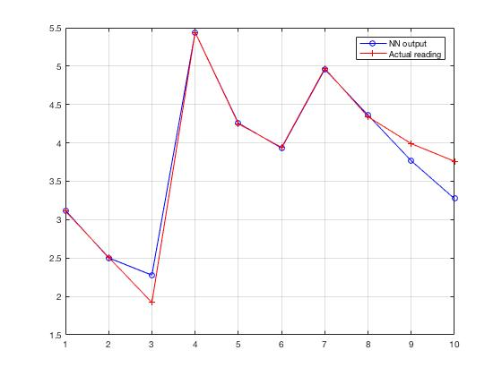

# A Study of Vibration Analysis using Neural Networks

## Introduction

The vibration analysis of the system is important for efficient functioning of the machines in the industry. Neural Networks in one of the methods that is used for predictive analysis with the help of input and output data. This research report aims at identifying several methods of vibration analysis using neural networks. The purpose of this study is to identify the importance of the vibration characteristics and the role of predictive analysis to improve the efficiency of the operation. This research report provides a foundation for the study of the vibration characteristics by providing a simulation of neural network with the data gathered from the research.
 
The study of vibration in a mechanical system is important to understand the behaviour of the system. There are many theories and set of formulae which are used to model a system and conduct the vibration analysis. The purpose of conducting the vibration analysis in a mechanical system is to find out the defects or faults in a component. Finding out the fault in a later stage can lead to extreme cost of the machine components along with the waste of the valuable production time. Many mechanical systems have become complex with several different subsystems integrated together. Therefore, it becomes difficult to model the behaviour of such systems. With an increment in the number of components and the non-linearity of the system, the traditional methods to analyse a system becomes difficult. Moreover, the data related to vibration and the correlation with stress and strain of the component needs to be processed efficiently without any loss of information. This data can be useful for the purpose of creating a model for the system under study. The study of the vibrational characteristics of such a system can be used to test the defects and faults in the system. It can also be used to come up with a predictive model of the system which can predict the types of deformation which can be caused due the vibration. This is where Neural Networks (NN) play an important role in creating a predictive model of a system where the input data is non-linear or too large to develop a mathematical model.
 
Artificial Intelligence (AI) is playing a key role in automating many processes. Different types of companies ranging from financial technology to manufacturing are all relying upon intelligent systems to automate the process. The purpose of automation is to minimize error and improve efficiency which would ultimately lead to productivity. To achieve these goals, engineers are designing algorithms and software programs to help humans analyse the data. Visualisation of data is very important in any organisation to help managers make decision which will be important for the growth of the company. While implementing a companywide AI may seem implausible at the moment, part of the system process can be automated with the help of principles which are involved in AI such as Machine Learning and Neural Networks.
 
Neural Networks and Machine Learning are widely used tools in almost every field of business. The core principle for using these two methods is to visualise the data and predict the future outcomes. Vibration is a subject of interest of many researchers in the field of mechanical engineering. Several theories are used to calculate the vibration of the system. But, as the system becomes more complex with an increment in the data, a mathematical approach in modelling the system may not give accurate results. Obtaining accurate results is of prime importance to ensure the functioning of the components in a machine. While considering fatigue failure, it is important to predict the failure of the component due to cyclic stress. A predictive analysis can be performed by obtaining data from a simulation to develop a model in relation to the stress and deformation. Neural network can be trained to identify the pattern of deformation related to the type of stress with the help of vibration data. By implementing sensors on the operating machine, a real-time data can be read. This data will be beneficial to predict the deformation in the component. The components can be replaced before the damage is exponentially increased while spreading over the entire machine.
 
Many researchers in the past have tested different approaches in implementing different algorithms for training the neural networks to construct highly accurate predictive models. The key challenges which are faced by the researchers is the availability of the data. For a small-scale experiment, several sensors can be fitted on a component of interest and a predictive analysis can be designed to understand the life-cycle of the component. However, while implementing multiple sensors on the entire machine which consists integration of several subsystems, the trained neural network models do not consider the behaviour of the other components. Therefore, it is necessary to obtain more data related to the operation of the machine. The data from a machine of a complex integrated subsystems can be obtained from a simulation software. However, the computational limitation of meshing the entire system can generate problem in obtaining the data. Moreover, it is difficult to generate external environmental factors which can influence the machines in a simulation. Therefore, experiments on actual systems must be conducted to obtain the data which can be used for predictive analysis.
 
This research report identifies different methods and algorithms that are used for vibration analysis on different components and different environment. This research report aims to contribute towards identifying efficient methods of training neural networks for different components. It also aims at providing a sample neural network problem to signify the importance of the future research necessary in this field.

## Methodology
The data that was collected from the research includes different methods to improve the efficiency of obtaining the most accurate results. Several methods that we identified in the literature review can be tested by training an ANN to predict the results for similar parameters. Feedforward with Backpropagation has been widely used in different research. Therefore, the data that was obtained in the research related to prediction and analysis of blast induced vibration for urban shallow buried tunnel was used for training the NN (Zuoming et al. 2015).
 
Data is the most important part in training the ANN. A Microsoft Excel file was created in which the data related to all the parameters were manually entered. The dataset consists of 40 data points. Out of 40 data points, 30 data points were used for the purpose of training and 10 were used for testing. The earlier experiments were conducted with 50 neurons in a single hidden layer. The results showed a large margin of error. Therefore, tests were conducted with different types of configuration of the ANN architecture. The research paper suggested that the number of neurons should be approximately 5 to 15 within a single hidden layer. However, the trial and error method to obtain accurate result proved that two hidden layers with 4 neurons in each layer provided more better results.

## Results

## Bibliography

Aditiya, NA, Darojah, Z, Sanggar, DR & Dharmawan, MR 2017, 'Fault diagnosis system of rotating machines using continuous wavelet transform and Artificial Neural Network', in 2017 International Electronics Symposium on Knowledge Creation and Intelligent Computing (IES-KCIC), pp. 173-6.
 
Etemad, SA & Ghaisari, J 2009, 'Estimating Shaft Crack Specifications Using Shaft Vibration Analysis and Neural Networks', in 2009 IEEE Circuits and Systems International Conference on Testing and Diagnosis, pp. 1-5.
 
Harrison, GA & Taylor, FJ 1999, 'Gas turbine vibration analysis with fuzzy ART neural network', in Neural Networks, 1999. IJCNN '99. International Joint Conference on, vol. 6, pp. 4319-23 vol.6.
 
Hu, X, Vian, J, Choi, J, Carlson, D & Il, DCW 2002, 'Propulsion vibration analysis using neural network inverse modeling', in Neural Networks, 2002. IJCNN '02. Proceedings of the 2002 International Joint Conference on, vol. 3, pp. 2866-71.
 
Liyanagedera, ND, Ratnaweera, A & Randeniya, DIB 2013, 'Vibration signal analysis for fault detection of combustion engine using neural network', in 2013 IEEE 8th International Conference on Industrial and Information Systems, pp. 427-32.
 
Moosavian, A, Najafi, G, Nadimi, H & Arab, M 2017, 'Estimation of engine friction using vibration analysis and artificial neural network', in 2017 International Conference on Mechanical, System and Control Engineering (ICMSC), pp. 130-5.
 
Nasiri, MR, Mahjoob, MJ & Vahid-Alizadeh, H 2011, 'Vibration signature analysis for detecting cavitation in centrifugal pumps using neural networks', in 2011 IEEE International Conference on Mechatronics, pp. 632-5.
 
Ş, Y, İ, E, Erkaya, S & Husi, G 2011, 'Vibration analysis of food industries mixing systems for long life using neural networks', in 2011 IEEE/ASME International Conference on Advanced Intelligent Mechatronics (AIM), pp. 197-202.
 
Wen, P 2009, 'Vibration Analysis and Prediction of Turbine Rotor Based Grey Artificial Neural Network', in 2009 International Conference on Measuring Technology and Mechatronics Automation, vol. 3, pp. 346-9.
 
Zuoming, Y, Desheng, W, Zhaoshuai, G & Shuchang, L 2015, 'Prediction and Analysis of Blast-Induced Vibration for Urban Shallow Buried Tunnel Using Various Types of Artificial Neural Networks', in 2015 8th International Conference on Intelligent Computation Technology and Automation (ICICTA), pp. 642-6.
